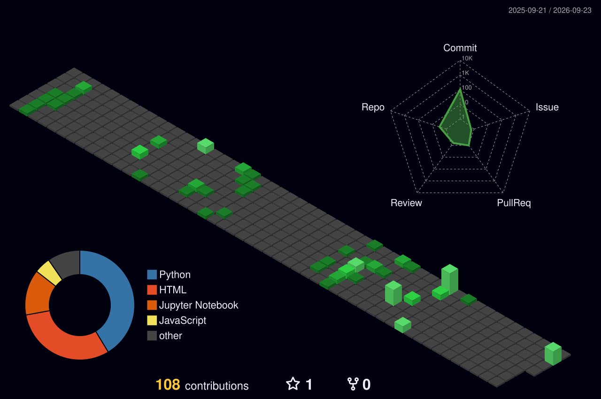

# Hi, I'm Dilip 👋
### Python Backend Developer | Cloud & DevOps | Ex-Production Support Engineer

<!-- Typing animation -->

---

### 👋 About Me

3 years as a Production Support Engineer — now transitioning into backend engineering with a Cloud/DevOps edge. I've spent years being the person who gets paged when things break; now I'm building the systems, so I understand both sides of that pager.

📍 India &nbsp;·&nbsp; 🌐 Open to remote & relocation &nbsp;·&nbsp; 🎯 Actively building in public

---

### 🔧 Tech Stack

**Languages:**  

**Backend:**  

**Cloud & DevOps:**     

**Testing:**    

**Monitoring:**  

---

### 🚧 Currently Building

Nothing shipped yet — and that's fine, it's Day 1. Here's the roadmap, updated as it happens:

- [ ] 🗂️ **Task Manager API** — FastAPI + Postgres + JWT auth, Dockerized, deployed live
- [ ] ⚙️ **CI/CD Pipeline + Monitoring Dashboard** — GitHub Actions → AWS, with Prometheus/Grafana
- [ ] 🤖 **AI Support Ticket Classifier** — LLM-powered, built on real production-support patterns
- [ ] 🧪 **Test Automation Portfolio** — Web (Selenium/Playwright) + Mobile (Appium/Sauce Labs), CI-integrated

*Check back — this list turns into real repo links as each one ships.*

---

### 🌆 3D Contribution Graph

<!-- This image is generated automatically by the GitHub Action described in the setup guide -->

---

### 📈 GitHub Stats

---

### 📫 Connect

📧 dilipkumar.txt@gmail.com

---
*Building in public. Check back as the projects above turn into real links.*

